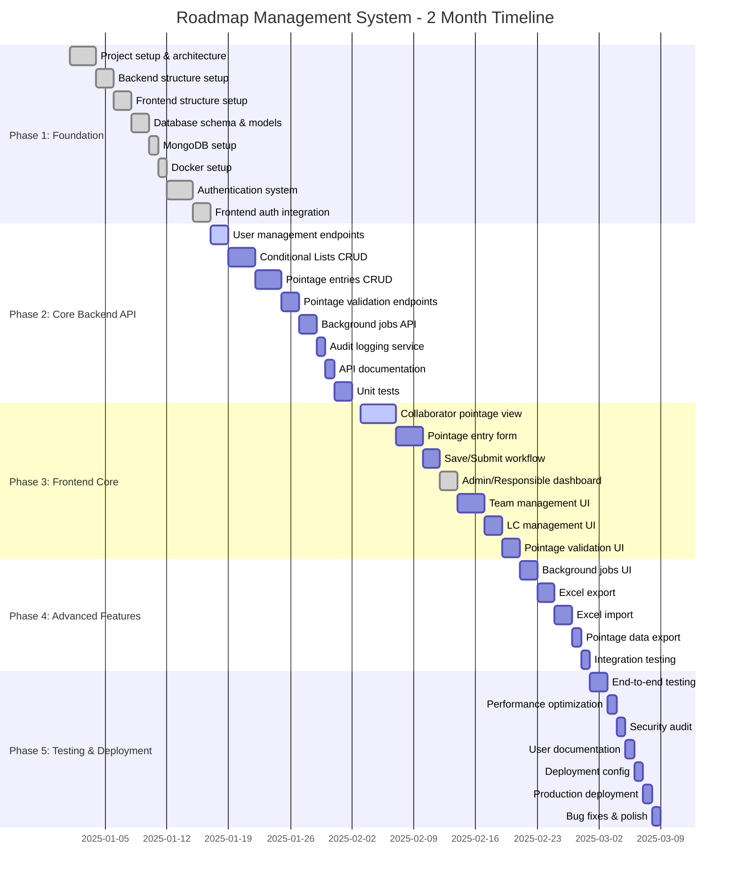

# Roadmap Management System - Project Gantt Chart

## Gantt Chart Visualization

## Project Description

The Roadmap Management System is a web-based time tracking and project management application designed for teams to manage pointage (time entries) with role-based access control. The system allows collaborators to fill daily time entries, responsibles to manage teams and validate entries, and admins to perform system-wide operations.

### Key Features

- **Role-Based Access Control**: Three user types (Collaborator, Responsible, Admin) with different permissions
- **Time Tracking (Pointage)**: Weekly calendar interface for collaborators to fill daily time entries
- **Conditional Lists (LC)**: Reference data management for pointage entries
- **Validation Workflow**: Draft → Submitted → Validated/Rejected workflow
- **Background Jobs**: Asynchronous processing for bulk operations
- **Audit Trail**: Complete logging of all operations
- **Excel Import/Export**: Support for Excel file operations

### Technology Stack

**Backend:**
- FastAPI (Python)
- MongoDB
- Keycloak (Authentication)
- Celery (Background jobs)

**Frontend:**
- React
- Vite
- Tailwind CSS

---

## Project Timeline: 2 Months (8 Weeks)

### Phase 1: Foundation & Setup (Week 1-2)
**Duration: 2 weeks**

| Task | Duration | Status |
|------|----------|--------|
| Project setup and architecture design | 3 days | ✅ Complete |
| Backend project structure setup | 2 days | ✅ Complete |
| Frontend project structure setup | 2 days | ✅ Complete |
| Database schema design and models | 2 days | ✅ Complete |
| MongoDB setup and configuration | 1 day | ✅ Complete |
| Docker setup for MongoDB | 1 day | ✅ Complete |
| Authentication system (Keycloak + Mock) | 3 days | ✅ Complete |
| Frontend authentication integration | 2 days | ✅ Complete |

**Deliverables:**
- ✅ Backend API structure
- ✅ Frontend React application
- ✅ Authentication system (mock + Keycloak)
- ✅ Database models and indexes
- ✅ Docker configuration

---

### Phase 2: Core Backend API (Week 3-4)
**Duration: 2 weeks**

| Task | Duration | Status |
|------|----------|--------|
| User management endpoints | 2 days | 🔄 In Progress |
| Conditional Lists (LC) CRUD endpoints | 3 days | ⏳ Pending |
| Pointage entries CRUD endpoints | 3 days | ⏳ Pending |
| Pointage validation endpoints | 2 days | ⏳ Pending |
| Background jobs API endpoints | 2 days | ⏳ Pending |
| Audit logging service | 1 day | ⏳ Pending |
| API documentation (OpenAPI/Swagger) | 1 day | ⏳ Pending |
| Unit tests for services | 2 days | ⏳ Pending |

**Deliverables:**
- User management API
- Conditional Lists API
- Pointage entries API
- Background jobs API
- API documentation

---

### Phase 3: Frontend Core Features (Week 5-6)
**Duration: 2 weeks**

| Task | Duration | Status |
|------|----------|--------|
| Collaborator pointage view (weekly calendar) | 4 days | 🔄 In Progress |
| Pointage entry form with LC autocomplete | 3 days | ⏳ Pending |
| Save/Submit workflow for entries | 2 days | ⏳ Pending |
| Admin/Responsible dashboard view | 2 days | ✅ Complete |
| Team management interface (Responsible) | 3 days | ⏳ Pending |
| Conditional Lists management UI | 2 days | ⏳ Pending |
| Pointage validation interface | 2 days | ⏳ Pending |

**Deliverables:**
- Complete collaborator pointage interface
- Admin/Responsible dashboard
- Team management UI
- LC management UI

---

### Phase 4: Advanced Features & Integration (Week 7)
**Duration: 1 week**

| Task | Duration | Status |
|------|----------|--------|
| Background jobs UI (status, progress) | 2 days | ⏳ Pending |
| Excel export functionality | 2 days | ⏳ Pending |
| Excel import functionality | 2 days | ⏳ Pending |
| Pointage data export (XML/Excel) | 1 day | ⏳ Pending |
| Integration testing | 1 day | ⏳ Pending |

**Deliverables:**
- Background jobs monitoring
- Excel import/export
- Data export features

---

### Phase 5: Testing, Documentation & Deployment (Week 8)
**Duration: 1 week**

| Task | Duration | Status |
|------|----------|--------|
| End-to-end testing | 2 days | ⏳ Pending |
| Performance testing and optimization | 1 day | ⏳ Pending |
| Security audit | 1 day | ⏳ Pending |
| User documentation | 1 day | ⏳ Pending |
| Deployment configuration | 1 day | ⏳ Pending |
| Production deployment | 1 day | ⏳ Pending |
| Bug fixes and final polish | 1 day | ⏳ Pending |

**Deliverables:**
- Tested and documented system
- Production-ready deployment
- User documentation

---

## Detailed Task Breakdown

### Backend Development (3.5 weeks)

#### Week 3: User & LC Management
- **User Management API** (2 days)
  - GET /api/v1/users - List users
  - POST /api/v1/users - Create user
  - GET /api/v1/users/{id} - Get user
  - PATCH /api/v1/users/{id} - Update user
  - DELETE /api/v1/users/{id} - Delete user

- **Conditional Lists API** (3 days)
  - GET /api/v1/conditional-lists - List LC
  - POST /api/v1/conditional-lists - Create LC
  - GET /api/v1/conditional-lists/{id} - Get LC
  - PATCH /api/v1/conditional-lists/{id} - Update LC
  - POST /api/v1/conditional-lists/{id}/apply - Apply LC updates
  - DELETE /api/v1/conditional-lists/{id} - Delete LC

#### Week 4: Pointage & Background Jobs
- **Pointage Entries API** (3 days)
  - GET /api/v1/pointage/entries - List entries
  - POST /api/v1/pointage/entries - Create entry
  - GET /api/v1/pointage/entries/{id} - Get entry
  - PATCH /api/v1/pointage/entries/{id} - Update entry
  - POST /api/v1/pointage/entries/{id}/submit - Submit entry
  - POST /api/v1/pointage/entries/{id}/validate - Validate entry
  - POST /api/v1/pointage/entries/{id}/reject - Reject entry

- **Background Jobs API** (2 days)
  - GET /api/v1/jobs - List jobs
  - GET /api/v1/jobs/{id} - Get job status
  - POST /api/v1/jobs/{id}/cancel - Cancel job

- **Audit Logging** (1 day)
  - Audit service implementation
  - Audit log endpoints

### Frontend Development (3 weeks)

#### Week 5: Collaborator Interface
- **Weekly Calendar View** (4 days)
  - Calendar grid (Monday-Sunday)
  - Week navigation
  - Entry status indicators
  - Day selection

- **Pointage Entry Form** (3 days)
  - LC autocomplete inputs (clef_imputation, libelle, fonction)
  - Date besoin input
  - Heures théoriques/passées inputs
  - Commentaires textarea
  - Form validation

- **Save/Submit Workflow** (2 days)
  - Save as draft
  - Submit for validation
  - Lock submitted entries
  - Status indicators

#### Week 6: Admin/Responsible Interface
- **Admin/Responsible Dashboard** (2 days) ✅
  - User information display
  - Role-based message

- **Team Management** (3 days)
  - View team members
  - Filter by team
  - Team statistics

- **LC Management UI** (2 days)
  - List LC items
  - Add/Edit/Delete LC items
  - Activate/Deactivate items

- **Pointage Validation** (2 days)
  - View submitted entries
  - Validate/Reject entries
  - Bulk validation

#### Week 7: Advanced Features
- **Background Jobs UI** (2 days)
  - Job list view
  - Job status monitoring
  - Progress indicators

- **Excel Operations** (4 days)
  - Export pointage data
  - Import pointage data
  - Export LC data
  - Import LC data

---

## Resource Allocation

### Development Team (Recommended)

- **1 Backend Developer** (Full-time, 2 months)
  - FastAPI development
  - MongoDB integration
  - Background jobs
  - API design

- **1 Frontend Developer** (Full-time, 2 months)
  - React development
  - UI/UX implementation
  - State management
  - API integration

- **1 Full-Stack Developer** (Part-time, 1 month)
  - Integration work
  - Testing
  - Documentation

### Alternative: Single Full-Stack Developer
- **1 Full-Stack Developer** (Full-time, 2 months)
  - All backend and frontend work
  - Testing and deployment

---

## Milestones

### Milestone 1: Foundation Complete (End of Week 2)
- ✅ Authentication system working
- ✅ Database structure in place
- ✅ Basic API endpoints
- ✅ Frontend authentication

### Milestone 2: Core Backend Complete (End of Week 4)
- All CRUD endpoints implemented
- Background jobs system
- Audit logging

### Milestone 3: Core Frontend Complete (End of Week 6)
- Collaborator interface complete
- Admin/Responsible interfaces
- All workflows functional

### Milestone 4: Feature Complete (End of Week 7)
- Excel import/export
- Background jobs UI
- All features implemented

### Milestone 5: Production Ready (End of Week 8)
- All tests passing
- Documentation complete
- Deployed to production

---

## Risk Factors & Mitigation

| Risk | Impact | Probability | Mitigation |
|------|--------|-------------|------------|
| Keycloak integration complexity | High | Medium | Use mock auth for development, integrate Keycloak in Phase 5 |
| MongoDB performance issues | Medium | Low | Proper indexing, query optimization |
| Frontend-backend integration delays | Medium | Medium | Early API contract definition, mock data |
| Excel file format complexity | Low | Medium | Use proven libraries (openpyxl), extensive testing |
| Background jobs scalability | Medium | Low | Use Celery with Redis, proper job queuing |

---

## Dependencies

### Critical Path
1. Authentication → All other features
2. Database models → API endpoints → Frontend integration
3. Pointage API → Frontend pointage view
4. LC API → LC management UI

### Parallel Work
- Frontend UI development can proceed in parallel with backend API development (using mock data)
- Documentation can be written alongside development
- Testing can be done incrementally

---

## Notes

- **Current Status**: Phase 1 (Foundation) is complete
- **Next Priority**: Phase 2 (Core Backend API) - User and LC management endpoints
- **Buffer Time**: 1-2 days buffer included in each phase for unexpected issues
- **Contingency**: If delays occur, Excel import/export can be moved to post-MVP

---

## Progress Tracking

**Overall Progress: ~15% Complete**

- ✅ Phase 1: Foundation & Setup (100%)
- 🔄 Phase 2: Core Backend API (10%)
- 🔄 Phase 3: Frontend Core Features (30%)
- ⏳ Phase 4: Advanced Features (0%)
- ⏳ Phase 5: Testing & Deployment (0%)

---

**Last Updated**: January 7, 2025  
**Project Start**: January 2025  
**Target Completion**: March 2025
