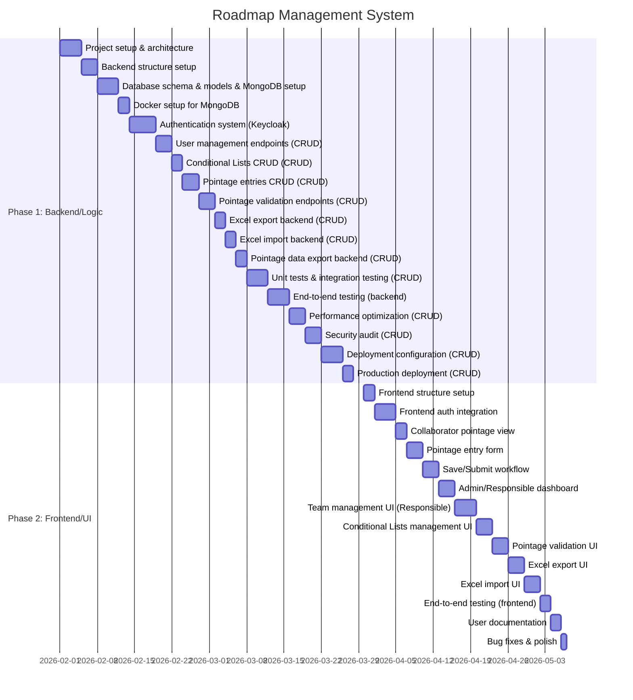

# Roadmap Management System - Project Gantt Chart

## Project Description

The Roadmap Management System is a web-based time tracking and project management application designed for teams to manage pointage (time entries) with role-based access control. The system allows collaborators to fill daily time entries, responsibles to manage teams and validate entries, and admins to perform system-wide operations.

## Gantt Chart Visualization

### Key Features

- **Role-Based Access Control**: Three user types (Collaborator, Responsible, Admin) with different permissions
- **Time Tracking (Pointage)**: Weekly calendar interface for collaborators to fill daily time entries
- **Conditional Lists (LC)**: Reference data management for pointage entries
- **Validation Workflow**: Draft → Submitted → Validated/Rejected workflow
- **Background Jobs**: Asynchronous processing for bulk operations
- **Audit Trail**: Complete logging of all operations
- **Excel Import/Export**: Support for Excel file operations

### Technology Stack

**Backend:**
- FastAPI (Python)
- MongoDB
- Keycloak (Authentication)
- Celery (Background jobs)

**Frontend:**
- React
- Vite
- Tailwind CSS

---

## Project Timeline

### Phase 1: Backend/Logic
**Duration: 54 days** (February 1 - March 27, 2026)

This phase focuses on building the complete backend infrastructure, APIs, and business logic for the Roadmap Management System.

### Phase 2: Frontend/UI
**Duration: 37 days** (March 30 - May 6, 2026)

This phase focuses on building the complete user interface and frontend functionality for the Roadmap Management System.

### All Tasks

| Phase | Category | Task | Duration | Description |
|-------|----------|------|----------|-------------|
| Backend/Logic | Foundation & Setup | Project setup and architecture | 4 days | Define project architecture and structure, set up repository and version control, configure development environment |
| Backend/Logic | Foundation & Setup | Backend structure setup | 3 days | Initialize FastAPI application, create project modules and directory structure, set up configuration management |
| Backend/Logic | Foundation & Setup | Database schema & models & MongoDB setup | 4 days | Design MongoDB database schema, define data models (User, Pointage, LC, etc.), create database indexes and relationships, install and configure MongoDB, set up database connections, configure database security |
| Backend/Logic | Foundation & Setup | Docker setup for MongoDB | 2 days | Create Docker configuration for MongoDB, set up container orchestration |
| Backend/Logic | Foundation & Setup | Authentication system (Keycloak) | 5 days | Integrate Keycloak authentication, set up JWT token handling and validation |
| Backend/Logic | API Development | User management endpoints (CRUD) | 3 days | Implement CRUD operations for users, user role management, user search and filtering |
| Backend/Logic | API Development | Conditional Lists CRUD (CRUD) | 2 days | Implement CRUD operations for conditional lists, LC activation/deactivation, LC bulk operations |
| Backend/Logic | API Development | Pointage entries CRUD (CRUD) | 3 days | Implement CRUD operations for pointage entries, entry status management (draft, submitted, validated, rejected), entry filtering and search |
| Backend/Logic | API Development | Pointage validation endpoints (CRUD) | 3 days | Implement validation workflow, bulk validation operations, rejection handling |
| Backend/Logic | Excel & Data Export | Excel export backend (CRUD) | 2 days | Export pointage data to Excel format, export LC data to Excel, Excel file generation with formatting |
| Backend/Logic | Excel & Data Export | Excel import backend (CRUD) | 2 days | Parse Excel files, validate imported data, bulk import processing with error handling |
| Backend/Logic | Excel & Data Export | Pointage data export backend (CRUD) | 2 days | XML export functionality, additional export formats (CSV, JSON), export job management |
| Backend/Logic | Testing & Deployment | Unit tests & integration testing (CRUD) | 4 days | Write unit tests for services, API endpoint tests, integration tests |
| Backend/Logic | Testing & Deployment | End-to-end testing (backend) | 4 days | Backend API testing, integration testing with external services, performance testing |
| Backend/Logic | Testing & Deployment | Performance optimization (CRUD) | 3 days | Identify performance bottlenecks, optimize database queries, implement caching strategies |
| Backend/Logic | Testing & Deployment | Security audit (CRUD) | 3 days | Security vulnerability assessment, code security review, implement security best practices |
| Backend/Logic | Testing & Deployment | Deployment configuration (CRUD) | 4 days | Set up deployment scripts, configure production environment, set up monitoring and logging |
| Backend/Logic | Testing & Deployment | Production deployment (CRUD) | 2 days | Deploy to production environment, verify deployment, set up backup and recovery |
| Frontend/UI | Foundation & Setup | Frontend structure setup | 2 days | Initialize React application with Vite, set up project structure and routing, configure Tailwind CSS |
| Frontend/UI | Foundation & Setup | Frontend auth integration | 4 days | Integrate authentication with backend, implement login/logout functionality, set up protected routes |
| Frontend/UI | Collaborator Interface | Collaborator pointage view | 2 days | Build weekly calendar grid (Monday-Sunday), implement week navigation, display entry status indicators, day selection and entry display |
| Frontend/UI | Collaborator Interface | Pointage entry form | 3 days | Create pointage entry form, implement LC autocomplete inputs (clef_imputation, libelle, fonction), date besoin input, heures théoriques/passées inputs, commentaires textarea, form validation |
| Frontend/UI | Collaborator Interface | Save/Submit workflow | 3 days | Implement save as draft functionality, submit for validation workflow, lock submitted entries, status indicators and feedback |
| Frontend/UI | Admin/Responsible Interface | Admin/Responsible dashboard | 3 days | User information display, role-based dashboard content, quick access to key features |
| Frontend/UI | Admin/Responsible Interface | Team management UI (Responsible) | 4 days | View team members, filter by team, team statistics and overview, team member management |
| Frontend/UI | Admin/Responsible Interface | Conditional Lists management UI | 3 days | List LC items with filtering, add/edit/delete LC items, activate/deactivate items, bulk operations |
| Frontend/UI | Admin/Responsible Interface | Pointage validation UI | 3 days | View submitted entries, validate/reject entries, bulk validation operations, entry details and history |
| Frontend/UI | Advanced Features | Excel export UI | 3 days | Export pointage data UI, export LC data UI, file download handling, export progress indicators |
| Frontend/UI | Advanced Features | Excel import UI | 3 days | File upload interface, import progress tracking, error display and handling, import validation feedback |
| Frontend/UI | Testing & Documentation | End-to-end testing (frontend) | 2 days | Frontend E2E tests, user flow testing, cross-browser testing |
| Frontend/UI | Testing & Documentation | User documentation | 2 days | User guides and tutorials, feature documentation, help system integration |
| Frontend/UI | Testing & Documentation | Bug fixes & polish | 1 day | Bug fixes, UI/UX improvements, final testing and refinements |

---